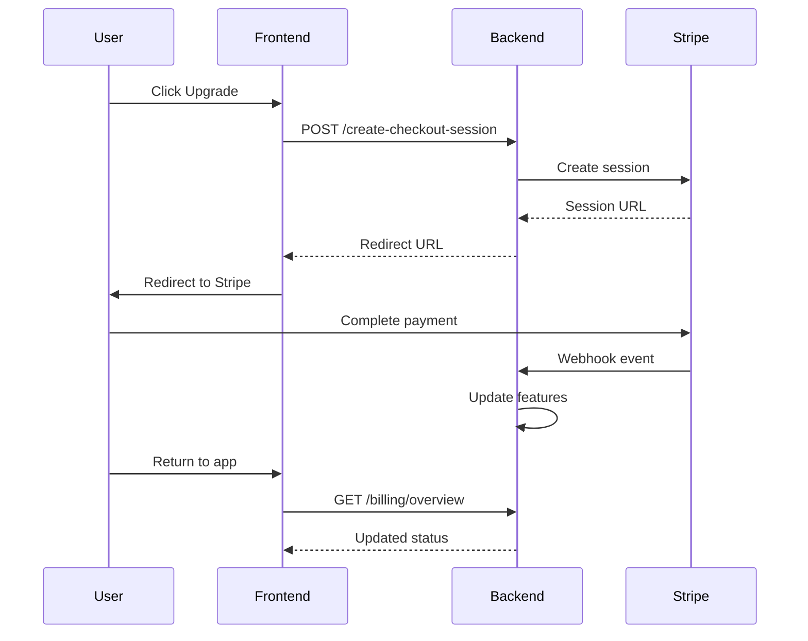

# Voyance Billing System - Source of Truth

This document serves as the definitive reference for Voyance's billing system implementation, covering frontend integration, backend API contracts, and Stripe payment flows.

## Table of Contents
1. [Core Principles](#core-principles)
2. [System Architecture](#system-architecture)
3. [Data Structures](#data-structures)
4. [API Endpoints](#api-endpoints)
5. [Frontend Implementation](#frontend-implementation)
6. [Stripe Integration](#stripe-integration)
7. [Feature Access Control](#feature-access-control)
8. [Error Handling](#error-handling)
9. [Testing Guidelines](#testing-guidelines)

## Core Principles

### 1. Backend-First Architecture
- **Frontend is display-only** - No billing logic or state management
- **Backend is authoritative** - All billing data comes from backend API
- **Stripe owns payment data** - No credit card info touches our servers
- **Real-time data** - Always fetch fresh billing status, minimal caching

### 2. Data Flow
```
┌─────────────┐     ┌──────────────┐     ┌─────────────┐
│   Frontend  │────▶│   Backend    │────▶│   Stripe    │
│  (Display)  │     │  (API Only)  │     │ (Payments)  │
└─────────────┘     └──────────────┘     └─────────────┘
                           │
                           ▼
                    ┌──────────────┐
                    │     NEON     │
                    │  (Metadata)  │
                    └──────────────┘
```

### 3. Security Requirements
- **No sensitive data in frontend** - No card numbers, no billing addresses
- **Token-based auth** - JWT in httpOnly cookies
- **Webhook verification** - Validate all Stripe webhooks
- **HTTPS only** - All billing endpoints require SSL

## System Architecture

### Subscription Tiers

| Tier | Internal ID | Price | Billing Period | Stripe Price ID |
|------|------------|-------|----------------|-----------------|
| Free Explorer | `free` | $0 | - | - |
| Voyage Monthly | `basic` | $15 | Monthly | `price_voyage_monthly` |
| Wanderlust Annual | `premium` | $120 | Annual | `price_wanderlust_annual` |
| Single Trip | `single_trip` | $19.99 | One-time | `price_single_trip` |

### Feature Matrix

| Feature | Free | Single Trip | Voyage | Wanderlust |
|---------|------|-------------|---------|------------|
| Dream Quiz | ✅ | ✅ | ✅ | ✅ |
| View Trip Previews | ✅ | ✅ | ✅ | ✅ |
| Full Itineraries | ❌ | ✅ (1 trip) | ✅ | ✅ |
| Save & Resume | ❌ | ✅ (1 trip) | ✅ | ✅ |
| Booking Access | ❌ | ✅ | ✅ | ✅ |
| PDF Export | ❌ | ❌ | ❌ | ✅ |
| Group Planning | ❌ | ❌ | ✅ (3 people) | ✅ (8 people) |
| AI Revisions | ❌ | 3 | Unlimited | Unlimited |
| Priority Support | ❌ | ❌ | ❌ | ✅ |
| Saved Destinations | 3 | 10 | Unlimited | Unlimited |
| Price Alerts | 2 | 5 | Unlimited | Unlimited |

## Data Structures

### Backend Billing Overview
```typescript
interface BackendBillingOverview {
  subscription: {
    hasActiveSubscription: boolean;
    tier: 'free' | 'basic' | 'premium' | 'enterprise';
    status: 'active' | 'canceled' | 'incomplete' | 'past_due' | 'trialing' | 'unpaid';
    currentPeriodEnd: string | null; // ISO date
    cancelAtPeriodEnd: boolean;
    stripeSubscriptionId: string | null;
    stripeCustomerId: string | null;
  };
  
  features: string[]; // Backend feature flags
  
  limits: {
    trips_remaining: number | 'unlimited';
    ai_revisions_remaining: number | 'unlimited';
    saved_destinations_max: number;
    saved_destinations_used: number;
    price_alerts_max: number;
    price_alerts_used: number;
  };
  
  paymentMethods: Array<{
    id: string;
    last4: string;
    brand: string;
    expiryMonth: number;
    expiryYear: number;
    isDefault: boolean;
  }>;
  
  recentTransactions: Array<{
    id: string;
    amount: number; // ALWAYS IN CENTS
    currency: string;
    status: 'pending' | 'completed' | 'failed' | 'refunded';
    created_at: string;
    description: string;
    metadata: Record<string, unknown>;
  }>;
  
  stats: {
    totalSpentAllTime: number; // IN CENTS
    totalSpentThisYear: number; // IN CENTS
    averageMonthlySpend: number; // IN CENTS
  };
}
```

### Profile Billing Summary (UI Formatted)
```typescript
interface ProfileBillingSummary {
  plan: {
    name: string; // "Voyage Monthly"
    badge: 'FREE' | 'PRO' | 'PREMIUM' | null;
    renewalText: string | null; // "Renews Dec 15, 2024"
  };
  
  stats: {
    totalSpent: string; // "$149.99" - formatted
    tripsPlanned: number;
    savedThisMonth: string; // "$45.00" - formatted
  };
  
  recentPurchases: Array<{
    id: string;
    date: string;
    description: string;
    amount: string; // "$19.99" - formatted
    status: 'completed' | 'refunded';
  }>;
  
  quickActions: Array<{
    label: string;
    action: 'upgrade' | 'manage' | 'add-payment' | 'view-invoices';
    variant: 'primary' | 'secondary';
  }>;
}
```

## API Endpoints

### 1. Get Billing Overview
```
GET /api/v1/user/billing/overview
Authorization: Bearer <token>

Response: BackendBillingOverview
```

### 2. Get Profile Billing Summary
```
GET /api/v1/user/billing/profile-summary
Authorization: Bearer <token>

Response: ProfileBillingSummary
```

### 3. Create Checkout Session
```
POST /api/v1/stripe/create-checkout-session
Authorization: Bearer <token>
Content-Type: application/json

Body:
{
  "priceId": "price_voyage_monthly",
  "successUrl": "https://app.voyance.com/billing/success",
  "cancelUrl": "https://app.voyance.com/billing/cancel",
  "metadata": {
    "tripId": "trip_123", // Optional
    "source": "profile_page"
  }
}

Response:
{
  "sessionId": "cs_test_xxxxx",
  "url": "https://checkout.stripe.com/pay/cs_test_xxxxx"
}
```

### 4. Create Customer Portal Session
```
POST /api/v1/user/billing/customer-portal
Authorization: Bearer <token>
Content-Type: application/json

Body:
{
  "returnUrl": "https://app.voyance.com/profile"
}

Response:
{
  "url": "https://billing.stripe.com/p/session/xxx"
}
```

### 5. Verify Checkout Session
```
GET /api/v1/stripe/session/{sessionId}
Authorization: Bearer <token>

Response:
{
  "success": true,
  "message": "Payment successful"
}
```

### 6. Track Conversion Opportunity
```
POST /api/v1/analytics/conversion-opportunity
Authorization: Bearer <token>
Content-Type: application/json

Body:
{
  "trigger": "itinerary_blur",
  "context": {
    "page": "/trip/paris-2024",
    "timestamp": "2024-01-15T10:30:00Z"
  }
}
```

## Frontend Implementation

### File Structure
```
src/
├── types/
│   └── billing.ts         # All billing TypeScript types
├── services/
│   └── billingAPI.ts      # API service layer
├── hooks/
│   └── useBilling.ts      # React hooks for billing
└── components/
    └── profile/
        ├── BillingSection.tsx      # Main billing UI
        ├── BillingPaymentForm.tsx  # Stripe payment form
        └── BillingUpgradeModal.tsx # Upgrade flow modal
```

### Key Implementation Files

#### 1. Types (`src/types/billing.ts`)
- Exact match with backend structures
- Helper functions for formatting prices
- Feature flag constants

#### 2. API Service (`src/services/billingAPI.ts`)
- No local state storage
- 5-minute cache for billing overview
- Clear cache on any billing changes
- Error handling with fallbacks

#### 3. Hooks (`src/hooks/useBilling.ts`)
- `useBilling()` - Main billing state and actions
- `useProfileBilling()` - Formatted data for profile
- `usePaymentSuccess()` - Payment verification
- `useFeatureGate()` - Feature access checking

#### 4. Components
- **BillingSection** - Display current plan and upgrade options
- **BillingPaymentForm** - Stripe Elements integration
- **BillingUpgradeModal** - Modal wrapper for payment flow

### Usage Examples

#### Check Feature Access
```typescript
const { canAccess, requireFeature } = useBilling();

// Simple check
if (canAccess('can_view_full_itinerary')) {
  // Show full itinerary
}

// With conversion tracking
if (!requireFeature('can_pdf_export', 'pdf_request')) {
  // Show upgrade prompt
  return <UpgradePrompt feature="PDF Export" />;
}
```

#### Start Upgrade Flow
```typescript
const { startCheckout } = useBilling();

const handleUpgrade = async () => {
  await startCheckout('price_voyage_monthly', {
    source: 'profile_page'
  });
  // User redirected to Stripe
};
```

#### Format Prices
```typescript
const { formatPrice } = useBilling();

// Backend returns 1500 (cents)
// Display: $15.00
<span>{formatPrice(billing.stats.totalSpentAllTime)}</span>
```

## Stripe Integration

### Environment Variables
```bash
# Required
VITE_STRIPE_PUBLIC_KEY=pk_test_xxx    # Frontend publishable key
STRIPE_SECRET_KEY=sk_test_xxx         # Backend secret key
STRIPE_WEBHOOK_SECRET=whsec_xxx       # Webhook endpoint secret

# Price IDs
VITE_STRIPE_PRICE_VOYAGE=price_xxx    # Monthly subscription
VITE_STRIPE_PRICE_WANDERLUST=price_xxx # Annual subscription
VITE_STRIPE_PRICE_SINGLE_TRIP=price_xxx # One-time purchase
```

### Webhook Events
| Event | Action |
|-------|--------|
| `checkout.session.completed` | Grant purchased features |
| `customer.subscription.created` | Activate subscription |
| `customer.subscription.updated` | Update subscription status |
| `customer.subscription.deleted` | Revoke subscription features |
| `invoice.payment_succeeded` | Log successful payment |
| `invoice.payment_failed` | Handle failed payment |
| `payment_intent.succeeded` | Process one-time payment |

### Payment Flow


## Feature Access Control

### Backend Feature Flags
```typescript
// Exact strings to use for feature checks
const BACKEND_FEATURES = {
  VIEW_FULL_ITINERARY: 'can_view_full_itinerary',
  SAVE_RESUME: 'can_save_resume',
  BOOK_FLIGHTS: 'can_book_flights',
  BOOK_HOTELS: 'can_book_hotels',
  PDF_EXPORT: 'can_pdf_export',
  AI_REVISIONS: 'can_ai_revisions',
  GROUP_PLANNING: 'can_group_planning',
  PREMIUM_FILTERS: 'can_premium_filters',
  SURPRISE_ME: 'can_surprise_me',
  PRICE_LOCK: 'can_price_lock',
  CONCIERGE_ACCESS: 'can_concierge_access',
  EARLY_FEATURES: 'can_early_features',
};
```

### Conversion Tracking Triggers
- `itinerary_blur` - Tried to view locked itinerary
- `save_attempt` - Tried to save without access
- `booking_intent` - Clicked book without access
- `pdf_request` - Requested PDF without access
- `group_invite` - Tried group planning without access

## Error Handling

### Common Error Codes
```typescript
enum BillingErrorCode {
  NO_CUSTOMER = 'NO_CUSTOMER',              // Never made a purchase
  SUBSCRIPTION_EXPIRED = 'SUBSCRIPTION_EXPIRED',
  PAYMENT_REQUIRED = 'PAYMENT_REQUIRED',    // Payment method failed
  STRIPE_ERROR = 'STRIPE_ERROR',            // Stripe API issue
  INVALID_PLAN = 'INVALID_PLAN',
  FEATURE_NOT_AVAILABLE = 'FEATURE_NOT_AVAILABLE',
}
```

### Error Handling Strategy
1. **API Errors** - Return default free tier status
2. **Payment Failures** - Redirect to update payment
3. **Network Errors** - Use cached data if available
4. **Stripe Errors** - Show user-friendly message

## Testing Guidelines

### Test Scenarios
1. **Free User Flow**
   - Can see locked features
   - Gets upgrade prompts
   - Can start checkout
   - Features unlock after payment

2. **Paid User Flow**
   - Sees all unlocked features
   - Can access customer portal
   - Sees accurate billing history
   - Can manage subscription

3. **Edge Cases**
   - Expired subscription
   - Failed payment
   - Refunded purchase
   - Network errors during billing

### Test Card Numbers
- **Success**: 4242 4242 4242 4242
- **Decline**: 4000 0000 0000 0002
- **3D Secure**: 4000 0025 0000 3155

### Mock Data
Use `VITE_USE_MOCK_DATA=true` to enable mock billing responses for development.

## Migration Notes

### From Old System
1. Remove all `localStorage` billing data
2. Remove hardcoded pricing
3. Update feature checks to use new flags
4. Convert price displays to handle cents
5. Update payment flows to use Stripe Checkout

### Database Cleanup
```sql
-- Remove deprecated fields
ALTER TABLE users 
DROP COLUMN IF EXISTS subscription_tier,
DROP COLUMN IF EXISTS subscription_status,
DROP COLUMN IF EXISTS stripe_customer_id; -- Now in subscriptions table
```

## Appendix

### Quick Reference

#### Check Subscription Status
```typescript
const { isSubscribed, tier } = useBilling();
```

#### Check Feature Access
```typescript
const { canAccess } = useBilling();
if (canAccess('can_pdf_export')) {
  // Show PDF button
}
```

#### Open Customer Portal
```typescript
const { openCustomerPortal } = useBilling();
await openCustomerPortal();
```

#### Track Conversion
```typescript
const { trackConversion } = useBilling();
await trackConversion('itinerary_blur');
```

### Important URLs
- Stripe Dashboard: https://dashboard.stripe.com
- Webhook Endpoint: https://api.voyance.com/webhooks/stripe
- Customer Portal Config: https://dashboard.stripe.com/settings/billing/portal

---

*Last Updated: December 2024*
*Version: 1.0*
*Maintainer: Engineering Team*