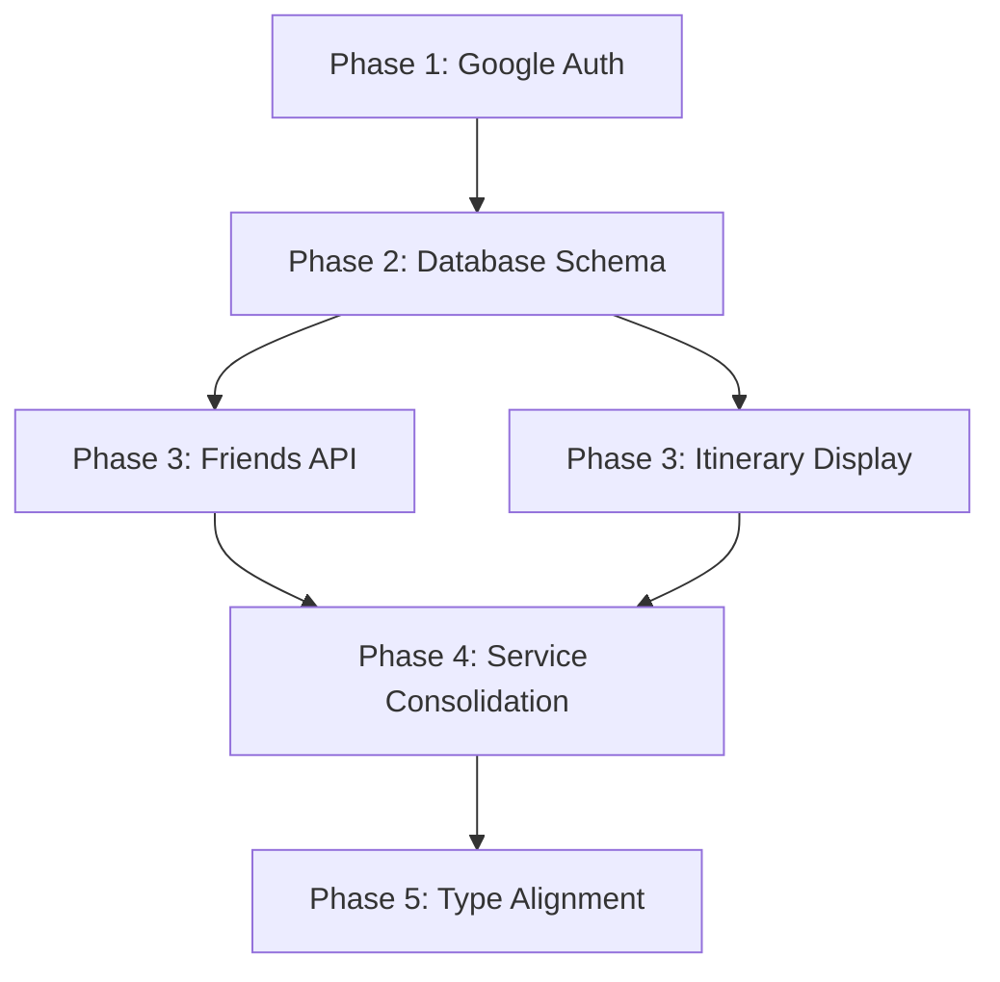

# Voyance Integration & Cleanup Plan

> Status: Planning Phase  
> Created: 2026-01-17  
> Last Updated: 2026-01-17

---

## Executive Summary

Three main features were not working in the previous implementation:
1. **Google Auth** - OAuth redirect issues
2. **Friends Feature** - Handle-based friend search not functional
3. **Itinerary Display** - Generated but not rendered in UI

This document outlines the strategy to fix these features while consolidating the codebase.

---

## Architecture Decision: Hybrid Backend

After technical assessment, we recommend a **hybrid approach**:

### Lovable Cloud (Supabase) - Primary
- ✅ Authentication (Email + Google OAuth)
- ✅ User Profiles & Preferences
- ✅ Friends & Social Features
- ✅ Trip Data Storage
- ✅ Saved Items & Collections
- ✅ Real-time Collaboration

### Railway Backend - AI Processing Only
- ✅ AI Itinerary Generation (long-running jobs)
- ✅ Amadeus API Integration (flights/hotels)
- ✅ Background job queues

**Rationale**: Supabase Edge Functions have a 60-second timeout, insufficient for AI generation that can take 30-90 seconds. Railway handles this better with background workers.

---

## Phase 1: Google Auth Fix

### Current State
- `SocialLoginButtons.tsx` correctly uses `supabase.auth.signInWithOAuth`
- Google provider is called but may not be configured in Lovable Cloud

### Required Actions

| Task | Status | Notes |
|------|--------|-------|
| Verify Google OAuth is enabled in Lovable Cloud | ⬜ TODO | Cloud → Users → Auth Settings |
| Test redirect URLs are correct | ⬜ TODO | Should be preview/production URLs |
| Remove dead code in `voyanceAuth.ts` for Railway Google auth | ⬜ TODO | Lines 244-285 unused |

### Implementation
```tsx
// SocialLoginButtons.tsx is already correct:
await supabase.auth.signInWithOAuth({
  provider: 'google',
  options: {
    redirectTo: `${window.location.origin}/`,
  },
});
```

No code changes needed - just configuration in Lovable Cloud.

---

## Phase 2: Friends Feature

### Current State
- `friendsAPI.ts` calls Railway backend endpoints
- No Supabase tables for friends/relationships

### Required Actions

| Task | Status | Notes |
|------|--------|-------|
| Create `profiles` table with `handle` column | ⬜ TODO | For username-based search |
| Create `friendships` table | ⬜ TODO | user_id, friend_id, status |
| Add RLS policies for privacy | ⬜ TODO | Users can only see their own friends |
| Create Edge Function for friend requests | ⬜ TODO | Handle verification + notifications |
| Update `friendsAPI.ts` to use Supabase | ⬜ TODO | Replace Railway calls |

### Database Schema (Proposed)

```sql
-- Profiles table (extends auth.users)
CREATE TABLE public.profiles (
  id UUID PRIMARY KEY REFERENCES auth.users(id) ON DELETE CASCADE,
  handle TEXT UNIQUE NOT NULL,
  display_name TEXT,
  avatar_url TEXT,
  bio TEXT,
  home_airport TEXT,
  created_at TIMESTAMPTZ DEFAULT now(),
  updated_at TIMESTAMPTZ DEFAULT now()
);

-- Friendships table
CREATE TABLE public.friendships (
  id UUID PRIMARY KEY DEFAULT gen_random_uuid(),
  requester_id UUID REFERENCES public.profiles(id) ON DELETE CASCADE,
  addressee_id UUID REFERENCES public.profiles(id) ON DELETE CASCADE,
  status TEXT CHECK (status IN ('pending', 'accepted', 'declined', 'blocked')),
  created_at TIMESTAMPTZ DEFAULT now(),
  updated_at TIMESTAMPTZ DEFAULT now(),
  UNIQUE(requester_id, addressee_id)
);

-- RLS Policies
ALTER TABLE public.profiles ENABLE ROW LEVEL SECURITY;
ALTER TABLE public.friendships ENABLE ROW LEVEL SECURITY;

-- Profiles: Public read for handle search, own write
CREATE POLICY "Public profiles are viewable by everyone"
  ON public.profiles FOR SELECT USING (true);

CREATE POLICY "Users can update own profile"
  ON public.profiles FOR UPDATE USING (auth.uid() = id);

-- Friendships: Users see their own relationships
CREATE POLICY "Users can view their own friendships"
  ON public.friendships FOR SELECT
  USING (auth.uid() IN (requester_id, addressee_id));

CREATE POLICY "Users can create friend requests"
  ON public.friendships FOR INSERT
  WITH CHECK (auth.uid() = requester_id);

CREATE POLICY "Addressee can update friendship status"
  ON public.friendships FOR UPDATE
  USING (auth.uid() = addressee_id);
```

### API Refactor

**Before** (Railway):
```typescript
const response = await fetch(`${BACKEND_URL}/api/v1/friends/request`, {
  method: 'POST',
  body: JSON.stringify({ handle }),
});
```

**After** (Supabase):
```typescript
// Verify handle exists
const { data: profile } = await supabase
  .from('profiles')
  .select('id')
  .eq('handle', handle)
  .single();

// Create friendship
const { data, error } = await supabase
  .from('friendships')
  .insert({
    requester_id: currentUserId,
    addressee_id: profile.id,
    status: 'pending'
  });
```

---

## Phase 3: Itinerary Display

### Current State
- `ItineraryPreview.tsx` uses `generateItinerary()` function with **hardcoded mock data**
- Real API (`itineraryAPI.ts`) is never called
- `useProgressiveItinerary` hook exists but not connected

### Root Cause
The preview component generates fake data instead of calling the backend:

```tsx
// ItineraryPreview.tsx lines 28-56 - PROBLEM
function generateItinerary(startDate, endDate) {
  const sampleActivities = [
    { time: '10:00 AM', title: 'Check-in & Explore', ... },
    // ... hardcoded activities
  ];
  return days.map(() => ({ activities: sampleActivities }));
}
```

### Required Actions

| Task | Status | Notes |
|------|--------|-------|
| Connect `ItineraryPreview` to real API | ⬜ TODO | Use `useItinerary` hook |
| Show loading state during generation | ⬜ TODO | Poll for status updates |
| Display backend-generated days | ⬜ TODO | Map API response to UI |
| Add error handling for failed generation | ⬜ TODO | Retry or show message |
| Create fallback for slow generation | ⬜ TODO | Show skeleton or progress |

### Implementation Approach

**Option A**: Keep Railway for generation, fix display only
```tsx
// In ItineraryPreview or parent component
const { data: itinerary, isLoading } = useItinerary(tripId, {
  refetchInterval: 3000 // Poll while generating
});

if (isLoading || itinerary?.status === 'generating') {
  return <ItineraryGeneratingState progress={itinerary?.progress} />;
}

if (itinerary?.status === 'ready' && itinerary?.itinerary) {
  return <FullItinerary itinerary={itinerary.itinerary} />;
}
```

**Option B**: Progressive display with `useProgressiveItinerary`
```tsx
const { days, loading, progress, message } = useProgressiveItinerary(tripId);

// Shows days as they're generated
return (
  <div>
    {days.map(day => <DayTimeline key={day.dayNumber} {...day} />)}
    {loading && <ProgressBar value={progress} message={message} />}
  </div>
);
```

---

## Phase 4: Service Consolidation

### Current Problem: 70+ Service Files

Many files have overlapping responsibilities and duplicated code:

| Pattern | Files | Issue |
|---------|-------|-------|
| Trip saving | `tripSaveResumeAPI.ts`, `savedTripsAPI.ts`, `saveTripAPI.ts` | 3 files doing similar things |
| Preferences | `preferencesV1API.ts`, `quizAPI.ts`, `quizExtendedAPI.ts` | Fragmented |
| Auth headers | Every service file | `getAuthHeader()` duplicated 30+ times |

### Consolidation Strategy

#### 1. Create Unified API Client

```typescript
// src/services/apiClient.ts
import { supabase } from '@/integrations/supabase/client';

const RAILWAY_URL = import.meta.env.VITE_BACKEND_URL;

// Shared auth header (DRY)
export async function getAuthHeader(): Promise<Record<string, string>> {
  const { data: { session } } = await supabase.auth.getSession();
  return session?.access_token 
    ? { Authorization: `Bearer ${session.access_token}`, 'Content-Type': 'application/json' }
    : { 'Content-Type': 'application/json' };
}

// Railway backend calls
export async function railwayRequest<T>(endpoint: string, options: RequestInit = {}): Promise<T> {
  const headers = await getAuthHeader();
  const response = await fetch(`${RAILWAY_URL}${endpoint}`, {
    ...options,
    headers: { ...headers, ...options.headers },
    credentials: 'include',
  });
  if (!response.ok) throw new Error(await response.text());
  return response.json();
}

// Supabase convenience wrapper
export { supabase };
```

#### 2. Group Related Services

**Proposed Structure:**
```
src/services/
├── apiClient.ts              # Unified client (new)
├── auth/
│   └── index.ts              # Supabase auth only
├── trips/
│   ├── index.ts              # Trip CRUD
│   ├── itinerary.ts          # Generation (Railway)
│   └── sharing.ts            # Collaboration
├── social/
│   ├── friends.ts            # Friends (Supabase)
│   └── savedItems.ts         # Bookmarks
├── booking/
│   ├── flights.ts            # Amadeus/Railway
│   └── hotels.ts             # Amadeus/Railway
└── user/
    ├── profile.ts            # Profile management
    └── preferences.ts        # User preferences
```

#### 3. Files to Delete (After Migration)

| File | Reason |
|------|--------|
| `voyanceAuth.ts` | Railway auth unused, using Supabase |
| `api.ts` | Replaced by `apiClient.ts` |
| `saveTripAPI.ts` | Consolidated into `trips/` |
| `savedTripsAPI.ts` | Consolidated into `trips/` |
| `tripSaveResumeAPI.ts` | Consolidated into `trips/` |
| `neonDb.ts` | Using Supabase, not Neon directly |

---

## Phase 5: Type Alignment

### Use Backend Schema Contracts

The schema files uploaded provide canonical types:
- `docs/schemas/trip-planner-sot-2.ts` - Trip, Flight, Hotel types
- `docs/schemas/frontend-preferences-2.ts` - User preferences
- `docs/schemas/strict-itinerary-schema.ts` - AI itinerary output

### Required Actions

| Task | Status | Notes |
|------|--------|-------|
| Copy schemas to `src/schemas/` | ⬜ TODO | Already in `docs/schemas/` |
| Export canonical types | ⬜ TODO | Create `src/schemas/index.ts` |
| Refactor components to use schema types | ⬜ TODO | Replace ad-hoc interfaces |
| Add Zod validation at API boundaries | ⬜ TODO | Validate responses |

---

## Implementation Order



**Recommended Sequence:**
1. ✅ Google Auth (config only, no code)
2. 🔄 Create Supabase tables (profiles, friendships, trips)
3. 🔄 Fix itinerary display (connect existing hooks)
4. 🔄 Migrate friends to Supabase
5. 🔄 Consolidate services
6. 🔄 Type alignment

---

## Success Criteria

| Feature | Test | Pass Criteria |
|---------|------|---------------|
| Google Auth | Click "Continue with Google" | Redirects to Google, returns signed in |
| Friends | Search by handle | Shows matching user, can send request |
| Friends | Accept request | Both users see each other as friends |
| Itinerary | Generate trip | Days appear in UI with activities |
| Itinerary | Regenerate day | New activities appear for that day |

---

## Risk Mitigation

| Risk | Mitigation |
|------|-----------|
| Railway backend goes down | Cache itineraries in Supabase after generation |
| Type mismatches | Validate with Zod schemas at boundaries |
| Migration breaks existing users | Keep backward compatibility, don't delete data |
| OAuth redirect issues | Verify all URLs in Supabase auth settings |

---

## Appendix: Environment Variables

### Required in Lovable Cloud
```
VITE_SUPABASE_URL (auto-set)
VITE_SUPABASE_PUBLISHABLE_KEY (auto-set)
VITE_BACKEND_URL=https://voyance-backend.railway.app
```

### Secrets (Edge Functions)
```
SUPABASE_SERVICE_ROLE_KEY (auto-set)
NEON_DATABASE_URL (for Railway, if needed)
```

---

## Document History

| Date | Author | Changes |
|------|--------|---------|
| 2026-01-17 | AI | Initial plan created |
